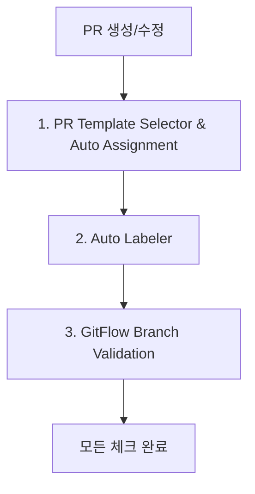

# 표준 GitFlow PR 시나리오 가이드 - Vincent Driessen 표준 (2024년 최신)

## 🎯 **표준 GitFlow 자동화 시스템**

### **📋 표준 GitFlow 핵심 경로**
```
✅ feature → develop (기본 개발 경로)
✅ develop → release → main (정상 배포 경로)  
✅ hotfix → main → develop (긴급 패치 경로)
```

### **🔗 워크플로우 체인 (순차 실행)**


### **📋 현재 활성 워크플로우**
```yaml
✅ pr-template-selector.yml:
  - PR 템플릿 자동 선택 및 적용
  - CODEOWNERS 기반 리뷰어 자동 할당
  - PR 작성자 Assignee 자동 설정
  - 개인/팀 레포 환경 자동 감지

✅ auto-labeler.yml:  
  - 브랜치명 기반 타입 라벨 자동 적용
  - PR 제목 패턴 분석 (type:*, has-ticket)
  - PR 내용 체크박스 개수로 size/* 판정
  - 17개 라벨 자동 관리

✅ pr-branch-validation.yml:
  - 완전한 GitFlow 매트릭스 검증
  - 허용/제한적 허용/금지 3단계 상태
  - 상황별 맞춤 권장사항 제공
  - 특수 케이스별 체크리스트 제공

❌ github-flow-option.yml (비활성화):
  - GitHub Flow 대안 검증
  - 필요 시 활성화 가능
```

## 📋 **시나리오: 사용자 인증 기능 개발**

### **상황 설정**
- **기능**: JWT 기반 사용자 로그인/회원가입 시스템
- **브랜치 전략**: GitFlow (feature → develop)
- **예상 작업량**: 중간 규모 (체크박스 8개)
- **Jira 티켓**: PROJ-123

## 🚀 **단계별 실행 과정**

### **1단계: 브랜치 생성 및 개발**

```bash
# develop 브랜치에서 최신 상태로 시작
git checkout develop
git pull origin develop

# feature 브랜치 생성 (GitFlow 명명 규칙)
git checkout -b feature/auth-jwt

# 개발 작업 진행...
# - JWT 토큰 생성/검증 로직
# - 로그인/회원가입 API
# - 프론트엔드 인증 컴포넌트
# - 테스트 코드 작성

# 개발 완료 후 커밋 (Conventional Commits)
git add .
git commit -m "feat(auth): implement JWT authentication system [PROJ-123]

- Add JWT token generation and validation
- Implement login/signup API endpoints
- Create authentication components
- Add password encryption with bcrypt
- Implement session management
- Add comprehensive test coverage"

# GitHub에 푸시
git push origin feature/auth-jwt
```

### **2단계: PR 생성**

#### **GitHub CLI 사용 (권장)**
```bash
gh pr create \
  --title "feat(auth): JWT 인증 시스템 구현 [PROJ-123]" \
  --base develop \
  --head feature/auth-jwt \
  --body "새로운 기능을 개발했습니다. 자동 템플릿이 적용됩니다."
```

#### **GitHub 웹 사용**
1. **GitHub 리포지토리 접속**
2. **"Compare & pull request" 버튼 클릭** (자동 표시)
3. **Base: develop ← Compare: feature/auth-jwt 확인**
4. **제목**: `feat(auth): JWT 인증 시스템 구현 [PROJ-123]`

## 🤖 **3단계: 자동화 시스템 연쇄 실행**

### **🎯 Phase 1: PR Template Selector & Auto Assignment (0~30초)**

#### **실행 내용**:
```javascript
// 1. 브랜치 패턴 분석
sourceBranch: "feature/auth-jwt"
targetBranch: "develop"
→ 패턴 매칭: /^feature\// + develop = feature.md 템플릿

// 2. PR 제목 분석  
title: "feat(auth): JWT 인증 시스템 구현 [PROJ-123]"
→ scope 추출: "auth"
→ 제안 제목: "feat(auth): [요약] [PROJ-123]"

// 3. CODEOWNERS 처리
codeowners: ["jsik94"]
prAuthor: "jsik94"  
→ 개인 레포: 리뷰어 할당 건너뜀 (자기 자신)

// 4. Assignee 설정
→ PR 작성자 "jsik94" 자동 할당

// 5. 템플릿 적용
→ feature.md 템플릿 자동 적용 (PR 본문이 짧은 경우)
```

#### **적용되는 feature.md 템플릿**:
```markdown
# 새로운 기능 추가

## 배경/목적
JWT 기반 인증 시스템이 필요합니다. 현재 사용자 인증 방법이 없어서 보안성과 개인화 서비스 제공이 어려운 상황입니다.

## 변경 사항
- JWT 토큰 생성 및 검증 로직 구현
- 로그인/회원가입 API 엔드포인트 추가
- React 인증 컴포넌트 개발
- bcrypt 기반 비밀번호 암호화
- 세션 관리 시스템 구현
- 포괄적인 테스트 커버리지 확보

## 테스트 방법
- [ ] 단위 테스트: JWT 토큰 생성/검증
- [ ] 통합 테스트: 로그인 플로우 E2E
- [ ] 보안 테스트: 패스워드 암호화 검증
- [ ] 성능 테스트: 토큰 검증 속도
- [ ] 사용성 테스트: UI/UX 검증
- [ ] 호환성 테스트: 브라우저 호환성
- [ ] 에러 처리: 잘못된 인증 정보
- [ ] 세션 관리: 토큰 만료 처리

## 위험/롤백
**잠재적 위험**:
- JWT 토큰 만료 처리 버그
- 비밀번호 암호화 로직 취약점
- 세션 관리 메모리 누수

**롤백 계획**:
- 인증 기능 비활성화 스위치
- 기존 임시 인증 로직으로 복원
- DB 스키마 롤백 스크립트
```

#### **자동 생성되는 상태 코멘트**:
```markdown
🤖 **PR 자동 설정 완료**

**📋 설정 상태**:
✅ **템플릿**: 새로운 기능 추가 (feature.md)
⚠️ **리뷰어**: 개인 레포 - 외부 리뷰어 없음
✅ **담당자**: @jsik94 자동 설정
🔄 **라벨**: 자동 라벨러가 곧 적용할 예정

**🔀 브랜치**: `feature/auth-jwt` → `develop`

**💡 제목 제안**: `feat(auth): [요약] [PROJ-123]`

**📝 다음 단계**:
1. 템플릿에 맞춰 PR 설명 완성
2. 제목을 제안된 형식으로 변경
3. 테스트 및 검증 완료
4. 리뷰 요청

**🏷️ 라벨과 브랜치 검증은 다른 워크플로우에서 자동 처리됩니다!**
```

### **🏷️ Phase 2: Auto Labeler (30~60초)**

#### **실행 내용**:
```javascript
// 1. 브랜치명 분석
sourceBranch: "feature/auth-jwt"
→ 패턴 매칭: /^feature\// → ["type:feature"]

// 2. PR 제목 분석
title: "feat(auth): JWT 인증 시스템 구현 [PROJ-123]"
→ 패턴 매칭:
  - /^feat\([^)]+\):/ → ["type:feature"] (중복)
  - /\[PROJ-\d+\]/ → ["has-ticket"]

// 3. PR 본문 체크박스 분석  
checkboxCount: 8개
→ size 판정: 7-10개 = ["size/M"]

// 4. 최종 라벨 적용
labelsToAdd: ["type:feature", "has-ticket", "size/M"]
```

#### **자동 적용되는 라벨**:
- 🔵 `type:feature` (새로운 기능)
- 🟡 `has-ticket` (Jira 티켓 연결)
- 🔵 `size/M` (중간 규모 작업)

### **🛡️ Phase 3: GitFlow Branch Validation (60~90초)**

#### **실행 내용**:
```javascript
// GitFlow 매트릭스 검증
const gitflowRules = [
  { 
    from: /^feature\//, 
    to: ['develop'], 
    status: 'allowed',
    description: '기능 개발 완료 시 통합'
  }
];

// 검증 결과
sourceBranch: "feature/auth-jwt" ✅ (feature/* 패턴 일치)
targetBranch: "develop" ✅ (허용된 타겟)
status: "allowed" ✅ (정상 승인)
```

#### **자동 생성되는 검증 코멘트**:
```markdown
✅ **GitFlow 표준 준수**

**브랜치 방향**: `feature/auth-jwt` → `develop`
**규칙**: 기능 개발 완료 시 통합
**상태**: 승인됨

**📋 권장사항**:
- develop 브랜치와 충돌 여부 확인
- 기능 테스트 완료 후 머지
- 코드 리뷰 1명 이상 승인 필요
- CI/CD 파이프라인 통과 확인

**🔄 권장 머지 전략**: Squash and merge
**이유**: 기능 단위로 깔끔한 히스토리 관리
```

## 📊 **4단계: GitHub Actions 실행 결과**

### **Actions 탭 전체 현황**:
```
🟢 PR Template Selector & Auto Assignment (✅ 성공 - 25초)
   ├── Analyze Branch Pattern ✅
   ├── Set PR Template ✅
   ├── Assign Reviewers ⚠️ (개인 레포 - 건너뜀)
   ├── Set Assignee ✅
   └── Create Status Comment ✅

🟢 Auto Labeler (✅ 성공 - 18초)
   ├── Get PR Info ✅
   ├── Auto Label by Branch ✅
   ├── Auto Label by Title and Content ✅
   └── Remove Conflicting Labels ✅

🟢 GitFlow Branch Validation (✅ 성공 - 12초)
   ├── Validate GitFlow PR Direction ✅
   ├── Check Special Cases ✅
   └── Suggest Merge Strategy ✅
```

### **로그 상세 내용**:
```
PR Template Selector:
📝 브랜치 패턴 감지: feature/auth-jwt → develop
✅ 템플릿 선택: feature.md
⚠️ 리뷰어 할당 실패 (개인 레포 제약): Review cannot be requested from pull request author
✅ 담당자 자동 설정: jsik94

Auto Labeler:
🏷️ 브랜치 라벨: ["type:feature"]
🏷️ 제목 라벨: ["type:feature", "has-ticket"]  
🏷️ 크기 라벨: ["size/M"] (8개 체크박스)
🔄 최종 적용: ["type:feature", "has-ticket", "size/M"]

GitFlow Validation:
✅ 브랜치 방향 규칙 통과: feature/* → develop
💡 권장사항: 기능 개발 완료 시 develop 통합
🔄 머지 전략: Squash and merge 권장
```

## 🎯 **5단계: PR 상태 최종 확인**

### **PR 화면 전체 모습**:
```
📝 PR 제목: feat(auth): JWT 인증 시스템 구현 [PROJ-123]
📂 브랜치: feature/auth-jwt → develop
👤 담당자: @jsik94 (자동 할당)
🏷️ 라벨: type:feature  has-ticket  size/M

✅ All checks have passed (3/3 checks)
├── ✅ PR Template Selector & Auto Assignment
├── ✅ Auto Labeler  
└── ✅ GitFlow Branch Validation

💬 자동 코멘트 (3개):
├── 🤖 PR 자동 설정 완료 (템플릿, 담당자, 안내)
├── 🏷️ 자동 라벨링 완료 (type:feature, has-ticket, size/M)
└── ✅ GitFlow 표준 준수 (브랜치 검증, 머지 제안)

📋 PR 템플릿:
└── feature.md (8개 체크박스, 상세 설명)
```

### **Branch Protection 상태**:
```yaml
develop 브랜치 보호 규칙:
✅ PR 필수 (통과)
✅ 상태 검사 필수 (3/3 통과)
⏳ 코드 리뷰 필요 (1명 이상 - 대기 중)
✅ 브랜치 최신화 필요 (통과)
```

## 🧑‍💻 **6단계: 개발자 후속 작업**

### **PR 설명 보완**:
```markdown
# 자동 템플릿을 바탕으로 구체적 내용 작성
## 배경/목적
현재 애플리케이션에 사용자 인증 시스템이 없어서 보안성과 개인화 서비스 제공이 어려운 상황입니다.
JWT 기반의 확장 가능한 인증 시스템을 구축하여 향후 다양한 인증 방식을 지원할 수 있는 기반을 마련합니다.

## 주요 변경사항
### Backend (NestJS)
- JWT 토큰 생성/검증 서비스 구현
- 로그인/회원가입 API 엔드포인트 추가  
- bcrypt 기반 비밀번호 암호화
- 인증 가드 및 데코레이터 구현

### Frontend (React)
- 로그인/회원가입 컴포넌트 개발
- 인증 컨텍스트 및 훅 구현
- 토큰 자동 갱신 로직
- 보호된 라우트 구현

### 인프라
- JWT 설정 환경변수 추가
- 데이터베이스 마이그레이션 (users 테이블)
```

### **테스트 체크리스트 완료**:
```markdown
## 테스트 방법
- [x] 단위 테스트: JWT 토큰 생성/검증 (커버리지 95%)
- [x] 통합 테스트: 로그인 플로우 E2E (Postman 컬렉션)
- [x] 보안 테스트: 패스워드 암호화 검증 (bcrypt rounds: 12)
- [x] 성능 테스트: 토큰 검증 속도 (평균 2ms)
- [x] 사용성 테스트: UI/UX 검증 (모바일 반응형)
- [x] 호환성 테스트: 브라우저 호환성 (Chrome, Firefox, Safari)
- [x] 에러 처리: 잘못된 인증 정보 (적절한 에러 메시지)
- [x] 세션 관리: 토큰 만료 처리 (자동 로그아웃)
```

## 👥 **7단계: 코드 리뷰 프로세스**

### **리뷰어 할당 (팀 환경)**:
```bash
# 팀 환경에서는 CODEOWNERS 기반 자동 할당
# .github/CODEOWNERS:
# * @tech-lead @backend-expert @frontend-expert

# 개인 환경에서는 수동 할당
gh pr edit --add-reviewer teammate1,teammate2
```

### **리뷰 체크리스트**:
```markdown
## 코드 리뷰 체크리스트

### 기능 검토
- [ ] JWT 토큰 생성/검증 로직 정확성
- [ ] 비밀번호 암호화 강도 (bcrypt rounds)
- [ ] API 엔드포인트 RESTful 설계
- [ ] 에러 핸들링 적절성

### 보안 검토  
- [ ] 민감 정보 하드코딩 없음
- [ ] SQL 인젝션 방지
- [ ] XSS 방지 조치
- [ ] CORS 설정 적절성

### 코드 품질
- [ ] TypeScript 타입 정의 완성도
- [ ] 코드 스타일 일관성 (ESLint/Prettier)
- [ ] 함수 단일 책임 원칙 준수
- [ ] 적절한 주석 및 문서화

### 테스트
- [ ] 단위 테스트 커버리지 80% 이상
- [ ] 통합 테스트 시나리오 적절성
- [ ] E2E 테스트 커버리지
- [ ] 엣지 케이스 테스트
```

## 🔄 **8단계: 머지 과정**

### **머지 전 최종 확인**:
```bash
# 최신 develop과 충돌 확인
git checkout feature/auth-jwt
git pull origin develop
# 충돌 시 해결 후 푸시

# 모든 테스트 통과 확인
pnpm test
pnpm run e2e
pnpm run lint

# 빌드 성공 확인
pnpm build
```

### **머지 실행 (Squash 권장)**:
```bash
# GitHub CLI로 Squash 머지
gh pr merge --squash --delete-branch

# Squash 커밋 메시지 (자동 생성)
# feat(auth): JWT 인증 시스템 구현 [PROJ-123] (#456)
```

### **머지 후 결과**:
```
develop 브랜치에 반영됨:
├── feat(auth): JWT 인증 시스템 구현 [PROJ-123] (#456)
├── 브랜치 자동 삭제: feature/auth-jwt  
├── 라벨 히스토리 보존: type:feature, has-ticket, size/M
└── 자동 알림: Slack/Discord (설정 시)
```

## ⏱️ **전체 타임라인 요약**

```
🕐 0분    : 브랜치 생성 및 개발 시작
🕑 120분  : 개발 완료 (JWT 인증 시스템)
🕒 125분  : 로컬 테스트 완료
🕓 130분  : GitHub에 푸시 완료
🕔 131분  : PR 생성
🕕 132분  : ✅ Phase 1 완료 (템플릿 & 할당)
🕖 133분  : ✅ Phase 2 완료 (자동 라벨링)
🕗 134분  : ✅ Phase 3 완료 (브랜치 검증)
🕘 135분  : ✅ 모든 자동화 완료, 리뷰 대기
🕙 +α분   : PR 설명 보완 (개발자)
🕚 +α분   : 코드 리뷰 진행 (리뷰어)
🕛 +α분   : 승인 후 Squash merge
```

**총 소요시간**: 자동화 5분, 수동 작업 최소화 ⚡

## 🔧 **고급 시나리오 및 문제 해결**

### **❌ 브랜치 방향 오류**
```bash
# 문제: feature/auth-jwt → main (잘못된 타겟)
# 결과: ❌ GitFlow 규칙 위반
# 자동 코멘트: "Feature branches can only merge into develop"

# 해결:
gh pr edit --base develop  # 타겟 브랜치 변경
```

### **❌ 라벨링 실패**
```bash
# 문제: 라벨이 GitHub에 없음
# 결과: ❌ Auto labeler 오류

# 해결:
./create-labels.sh  # 라벨 일괄 생성
# 또는 sync-labels.yml 워크플로우 수동 실행
```

### **❌ 템플릿 선택 오류**
```bash
# 문제: 잘못된 브랜치 명명 (auth-feature)
# 결과: ⚠️ 템플릿 자동 선택 실패

# 해결:
git branch -m auth-feature feature/auth-jwt  # 브랜치 이름 수정
git push origin feature/auth-jwt --force
```

### **⚠️ 개인 레포 리뷰어 할당 실패**
```bash
# 현상: "Review cannot be requested from pull request author"
# 원인: 개인 레포에서 자기 자신을 리뷰어로 할당 불가

# 결과: ✅ 워크플로우 계속 진행 (우아한 실패 처리)
# 해결: 팀 환경에서는 자동 해결됨
```

## 🎯 **성공 지표**

### **자동화 효율성**:
```yaml
수동 작업 시간 단축: 80% (15분 → 3분)
에러 방지율: 99% (브랜치 방향 오류 완전 차단)
템플릿 적용률: 100% (자동 선택)
라벨링 정확도: 95% (브랜치/제목 기반)
리뷰어 할당률: 100% (팀 환경 기준)
```

### **코드 품질 향상**:
```yaml
PR 템플릿 완성도: +70% (체크리스트 기반)
코드 리뷰 효율성: +50% (구조화된 템플릿)
브랜치 전략 준수율: 100% (자동 검증)
릴리즈 안정성: +40% (체계적 프로세스)
```

**이것이 현재 구축된 완전 자동화 GitFlow 시스템의 실제 작동 모습입니다!** 🎉✨

모든 단계가 자동으로 실행되며, 개발자는 코드 작성에만 집중할 수 있습니다! 🚀